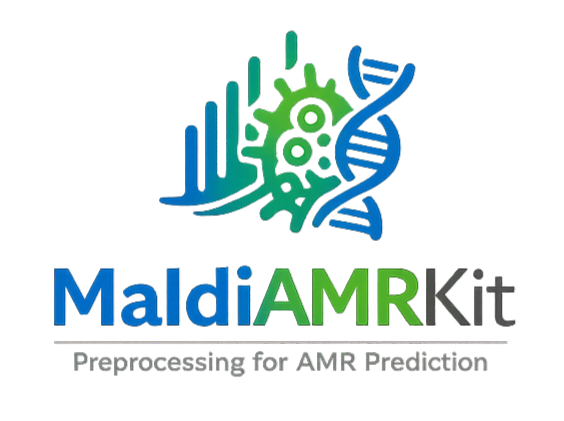

# MaldiAMRKit

[](https://github.com/EttoreRocchi/MaldiAMRKit/actions/workflows/ci.yml)
[](https://codecov.io/github/EttoreRocchi/MaldiAMRKit)
[](https://maldiamrkit.readthedocs.io/)

[](https://pypi.org/project/maldiamrkit/)
[](https://pypi.org/project/maldiamrkit/)
[](https://github.com/EttoreRocchi/MaldiAMRKit/blob/main/LICENSE)

<p align="center">
  
</p>

<p align="center">
  <strong>A comprehensive toolkit for MALDI-TOF mass spectrometry data preprocessing for antimicrobial resistance (AMR) prediction purposes</strong>
</p>

<p align="center">
  <a href="#installation">Installation</a> •
  <a href="#features">Features</a> •
  <a href="#quick-start">Quick Start</a> •
  <a href="https://maldiamrkit.readthedocs.io/">Documentation</a> •
  <a href="#tutorials">Tutorials</a> •
  <a href="#maldisuite-ecosystem">MaldiSuite</a> •
  <a href="#contributing">Contributing</a> •
  <a href="#citing">Citing</a> •
  <a href="#license">License</a>
</p>

## Installation

```bash
pip install maldiamrkit
```

### Install the full MaldiSuite

To install MaldiAMRKit together with [MaldiBatchKit](https://github.com/EttoreRocchi/MaldiBatchKit) and [MaldiDeepKit](https://github.com/EttoreRocchi/MaldiDeepKit) at compatible versions, install the [`maldisuite`](https://pypi.org/project/maldisuite/) meta-package:

```bash
pip install maldisuite
```

Visit the **MaldiSuite** landing page at <https://ettorerocchi.github.io/MaldiSuite/>.

### Optional: Batch Correction & UMAP

```bash
pip install maldiamrkit[batch]
```

Installs [`combatlearn`](https://github.com/EttoreRocchi/combatlearn) for ComBat-based batch effect correction and `umap-learn` for UMAP exploratory plots.

### Development Installation

```bash
git clone https://github.com/EttoreRocchi/MaldiAMRKit.git
cd MaldiAMRKit
pip install -e .[dev]
```

## Features

### Preprocessing
- **Composable Pipeline**: Build custom `PreprocessingPipeline` from individual transformers (smoothing, baseline correction, normalization, trimming), serializable to JSON/YAML
- **Smoothing**: Savitzky-Golay and moving-average filters
- **Baseline Correction**: SNIP, morphological top-hat, lower-convex-hull, and iterative rolling-median baselines
- **Multiple Binning Strategies**: Uniform, proportional, adaptive, and custom bin edges
- **Quality Metrics**: SNR estimation, MAD-based noise estimation, comprehensive quality reports, and alignment assessment
- **Replicate Merging**: Mean/median/weighted merging with correlation-based outlier detection

### Alignment & Detection
- **Spectral Alignment**: Shift, linear, piecewise, DTW, quadratic, cubic, and LOWESS warping for both binned and raw full-resolution spectra
- **Peak Detection**: Local maxima and persistent homology methods

### Evaluation
- **AMR Metrics**: VME, ME, sensitivity, specificity, categorical agreement, and `amr_classification_report` following EUCAST/CLSI conventions
- **Label Encoding**: `LabelEncoder` for mapping R/I/S to binary with configurable intermediate handling
- **Stratified Splitting**: Species-drug stratified and case-based (patient-grouped) splitting to prevent data leakage

### Differential Analysis
- **`DifferentialAnalysis`**: Per-bin statistical testing (Mann-Whitney U, Welch's t-test) between resistant and susceptible groups, with multiple-testing correction, log2 fold change, and Cohen's d effect size
- **Peak Selection**: `top_peaks()` by adjusted p-value, `significant_peaks()` with fold-change and p-value thresholds, `compare_drugs()` for multi-drug boolean significance matrices
- **AMR-Aware Plots**: `plot_volcano()`, `plot_manhattan()` along the m/z axis, and `plot_drug_comparison()` with binary heatmap or UpSet-style intersection view

### Drift Monitoring
- **`DriftMonitor`**: Anchor a baseline on early timestamps (default: first 20%) and track temporal drift via three complementary views - reference similarity of per-window median spectra, PCA centroid trajectory in a baseline-fitted PCA space, and Jaccard stability of top-k differential peaks over time
- **Trajectory Plots**: `plot_reference_drift`, `plot_pca_drift`, `plot_peak_stability`, `plot_effect_size_drift`

### Data Management
- **Dataset Building & Loading**: `DatasetBuilder` and `DatasetLoader` with pluggable layout adapters (`FlatLayout`, `BrukerTreeLayout`, `DRIAMSLayout`, `MARISMaLayout`)
- **Bruker Format Support**: Read Bruker flexAnalysis binary data (fid/1r + acqus) natively via `read_spectrum()` on directories
- **MIC Parsing**: `parse_mic_column()` for parsing MIC strings with qualifiers and European decimals
- **Composable Filters**: `SpeciesFilter`, `DrugFilter`, `QualityFilter`, `MetadataFilter` combinable with `&`/`|`/`~` operators
- **Spectrum Export**: Save spectra to CSV or TXT via `MaldiSpectrum.save()` and `MaldiSet.save_spectra()`

### Visualization & Tools
- **Exploratory Plots**: PCA, t-SNE, and UMAP scatter plots colored by species, resistance phenotype, or any metadata column
- **Batch Effect Correction**: Multi-site/multi-instrument correction via [`combatlearn`](https://github.com/EttoreRocchi/combatlearn) (`pip install maldiamrkit[batch]`)
- **CLI**: `maldiamrkit preprocess`, `maldiamrkit quality`, and `maldiamrkit build` for batch processing
- **Parallel Processing**: Multi-core support via `n_jobs` parameter
- **ML-Ready**: Direct integration with scikit-learn pipelines

## Documentation

Full documentation is available at [maldiamrkit.readthedocs.io](https://maldiamrkit.readthedocs.io/).

## Quick Start

### Load and Preprocess a Single Spectrum

```python
from maldiamrkit import MaldiSpectrum

# Load spectrum from file
spec = MaldiSpectrum("data/spectrum.txt")

# Preprocess: smoothing, baseline removal, normalization
spec.preprocess()

# Optional: bin to reduce dimensions
spec.bin(bin_width=3)  # 3 Da bins

# Visualize
from maldiamrkit.visualization import plot_spectrum
plot_spectrum(spec, binned=True)
```

### Build a Dataset from Multiple Spectra

```python
from maldiamrkit import MaldiSet

# Load multiple spectra with metadata
data = MaldiSet.from_directory(
    spectra_dir="data/spectra/",
    meta_file="data/metadata.csv",
    aggregate_by=dict(antibiotics="Drug", species="Escherichia coli"),
    bin_width=3
)

# Access features and labels
X = data.X  # Feature matrix
y = data.get_y_single("Drug")  # Target labels
```

### Machine Learning Pipeline

```python
from sklearn.pipeline import Pipeline
from sklearn.preprocessing import StandardScaler
from sklearn.ensemble import RandomForestClassifier
from sklearn.model_selection import cross_val_score
from maldiamrkit.alignment import Warping
from maldiamrkit.detection import MaldiPeakDetector

# Create ML pipeline
pipe = Pipeline([
    ("peaks", MaldiPeakDetector(binary=False, prominence=0.05)),
    ("warp", Warping(method="shift")),
    ("scaler", StandardScaler()),
    ("clf", RandomForestClassifier(n_estimators=100, random_state=42))
])

# Cross-validation
scores = cross_val_score(pipe, X, y, cv=5, scoring="accuracy")
print(f"CV Accuracy: {scores.mean():.3f} +/- {scores.std():.3f}")
```

For more examples covering alignment, filtering, evaluation, CLI usage, and more, see the
[Quickstart Guide](https://maldiamrkit.readthedocs.io/quickstart.html) and
[API Reference](https://maldiamrkit.readthedocs.io/api/index.html).

## Tutorials

For more detailed examples, see the notebooks:

- [Quick Start](notebooks/01_quick_start.ipynb) - Loading, preprocessing, binning, and quality assessment
- [Peak Detection](notebooks/02_peak_detection.ipynb) - Local maxima and persistent homology methods
- [Alignment](notebooks/03_alignment.ipynb) - Warping methods and alignment quality
- [Evaluation](notebooks/04_evaluation.ipynb) - AMR metrics, label encoding, and stratified splitting
- [Exploration](notebooks/05_exploration.ipynb) - PCA, t-SNE, UMAP visualizations and batch correction
- [Differential Analysis](notebooks/06_differential_analysis.ipynb) - R vs. S peak testing, volcano/Manhattan plots, and multi-drug comparison
- [Drift Monitoring](notebooks/07_drift_monitoring.ipynb) - Baseline-anchored drift detection: reference similarity, PCA trajectory, peak stability, and effect-size drift

## MaldiSuite Ecosystem

MaldiAMRKit is the data-model and preprocessing package of the **MaldiSuite** ecosystem:

- **MaldiAMRKit** (this package) - data model (`MaldiSpectrum`, `MaldiSet`), preprocessing, alignment, peak detection, differential analysis, and AMR-aware evaluation.
- **[MaldiBatchKit](https://github.com/EttoreRocchi/MaldiBatchKit)** - batch-effect correction and harmonisation for multi-centre / multi-instrument MALDI-TOF spectra.
- **[MaldiDeepKit](https://github.com/EttoreRocchi/MaldiDeepKit)** - sklearn-compatible deep learning classifiers (MLP, CNN, ResNet, Transformer).

The three packages share the `MaldiSet` / `MaldiSpectrum` data model and are designed to compose in a single end-to-end pipeline. Install the full suite with `pip install maldisuite`. Landing page: [MaldiSuite](<https://ettorerocchi.github.io/MaldiSuite/>).

## Contributing

Pull requests, bug reports, and feature ideas are welcome. See the [Contributing Guide](CONTRIBUTING.md) for how to get started.

## Citing

If you use MaldiAMRKit in your research, please cite:

> Rocchi, E., Nicitra, E., Calvo, M. et al. *Combining mass spectrometry and machine learning models for predicting Klebsiella pneumoniae antimicrobial resistance: a multicenter experience from clinical isolates in Italy*. **BMC Microbiol** (2026). [doi:10.1186/s12866-025-04657-2](https://link.springer.com/article/10.1186/s12866-025-04657-2)

See the [full publications list](https://maldiamrkit.readthedocs.io/papers.html) for more papers using MaldiAMRKit.

## License

This project is licensed under the **MIT License**. See the [LICENSE](LICENSE) file for details.

## Acknowledgements

This toolkit is inspired by:

> **Weis, C., Cuénod, A., Rieck, B., et al.** (2022). *Direct antimicrobial resistance prediction from clinical MALDI-TOF mass spectra using machine learning*. **Nature Medicine**, 28, 164-174. [https://doi.org/10.1038/s41591-021-01619-9](https://doi.org/10.1038/s41591-021-01619-9)
